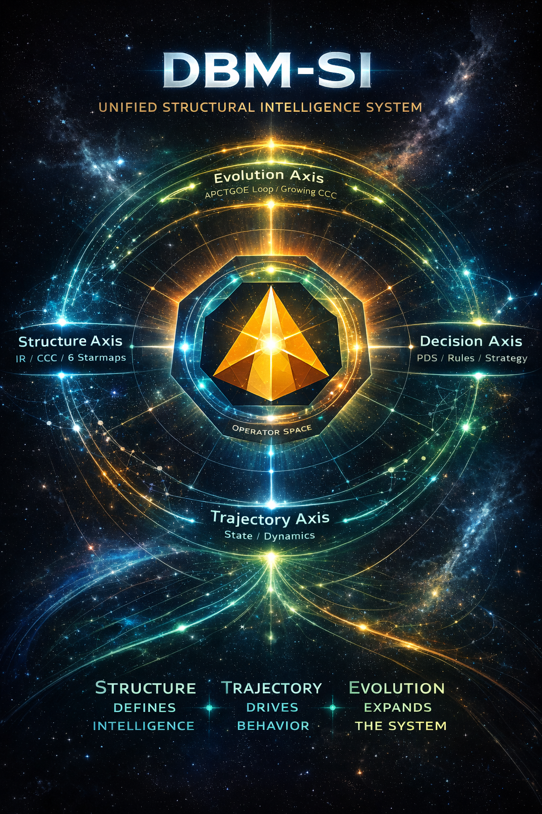
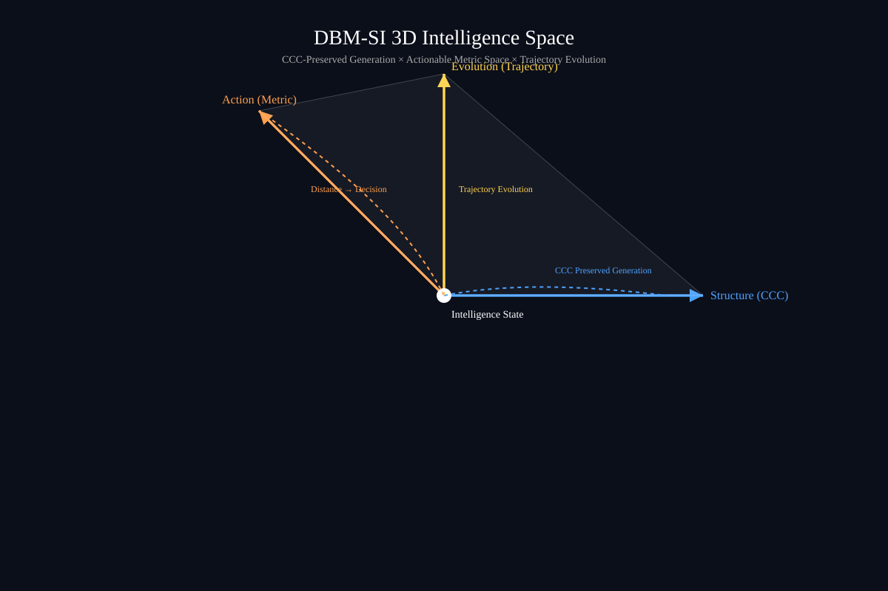

# 🧠 DBM Policy Decision System (PDS)
### A Fish-Control Paradigm for Intelligent Systems

**This project is part of the DBM-SI Structural Intelligence paradigm.**

---

## 🔥 One Sentence

**Most AI systems predict outcomes.  
PDS systems control which outcomes become reality.**

---

## ⚡ 3-Second Understanding

    PDS = Knowledge × State × Future × Decision × Policy
    

- **Knowledge (I)** → what the system knows  
- **State (II)** → where it is  
- **Future (III)** → what it can do  
- **Decision (IV)** → how it chooses  
- **Policy (V)** → why it chooses  

---

## 🐟 Core Insight — Fish-Control Structure

> Intelligence is not direct control.  
> It is **guided behavior inside a policy-shaped future space**.

---

## 🔁 Structural Intelligence Trinity

    CCC (Structure)
    ↓
    Trajectory (Dynamics)
    ↓
    PDS (Control)
    

- CCC → defines structure  
- Trajectory → defines evolution  
- **PDS → defines decision & control**

---

## 🧭 Paradigm Shift

| Traditional AI | PDS |
|----------------|-----|
| Predict Y | Select Y |
| Single output | Multiple futures |
| Implicit objective | Explicit policy |
| Static mapping | Controlled trajectory |

---

## 🧩 What is PDS?

PDS is a **control-centric decision architecture** composed of five pillars:

1. **Knowledge Model (Y=f(X))**
2. **State / Trajectory**
3. **Future Candidate Space**
4. **Decision Engine**
5. **Policy System**

It reframes intelligence as:

> **Policy-governed traversal over future space**

---

## 🚀 What This Repository Contains

- 📘 PDS theoretical framework (P01–P19)
- 📊 Canonical diagrams & posters
- ⚙ Minimal Java runtime (plug-in architecture)
- 🏭 Industrial use cases (finance / driving / coding)
- 📐 Formalization & benchmark design
- 🧭 Policy system deep structure
- 🔁 Dynamic PDS & evolution loop

---

## 🧭 Getting Started

👉 Start here: **[START-HERE.md](./START-HERE.md)**

Recommended path:

1. Canonical Poster  
2. Five Pillars  
3. Fish-Control Structure  
4. Policy System  
5. Dynamic PDS  

---

## 🧠 Key Idea

> **Policy is not an add-on — it is the missing dimension of intelligence.**

---

## 🔬 Positioning

PDS is a **unifying control framework** that can incorporate:

- LLMs → Knowledge / Candidate generation  
- RL → Adaptive decision learning  
- Control theory → feedback & stability  

---

## 🧪 Example Applications

- AI Coding Systems  
- Trajectory Risk Intelligence (Finance)  
- Autonomous Driving  
- Enterprise Decision Engines  

---

## 🔥 Manifesto

> AI is not about predicting the future —  
> it is about deciding which future to realize.

> **As AI systems take over implementation, human control shifts from writing logic to shaping policy.**

> **Model produces possibilities.**\
> **Policy decides reality.**

---

# DBM-SI 3D Intelligence Space

---

## 🧾 Citation

DBM Policy Decision System (PDS)  
Version: v1.0  
Year: 2026  

License: Apache

DOI: TBD

Repository: https://github.com/sizhet/DBM-Policy-Decision-System

## DBM-SI Series of gitHub Repositories

[DBM-SI-Repository-Series—Master-Narrative.md](DBM-SI-Repository-Series—Master-Narrative.md)

## DBM-SI Core Concepts Summary by Numbers

[DBM-SI-Core-Concepts-Summary-by-Numbers.md](DBM-SI-Core-Concepts-Summary-by-Numbers.md)

