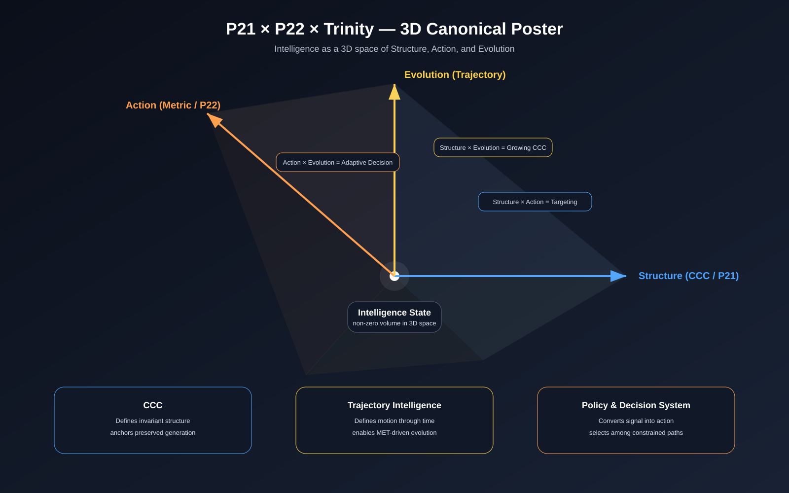
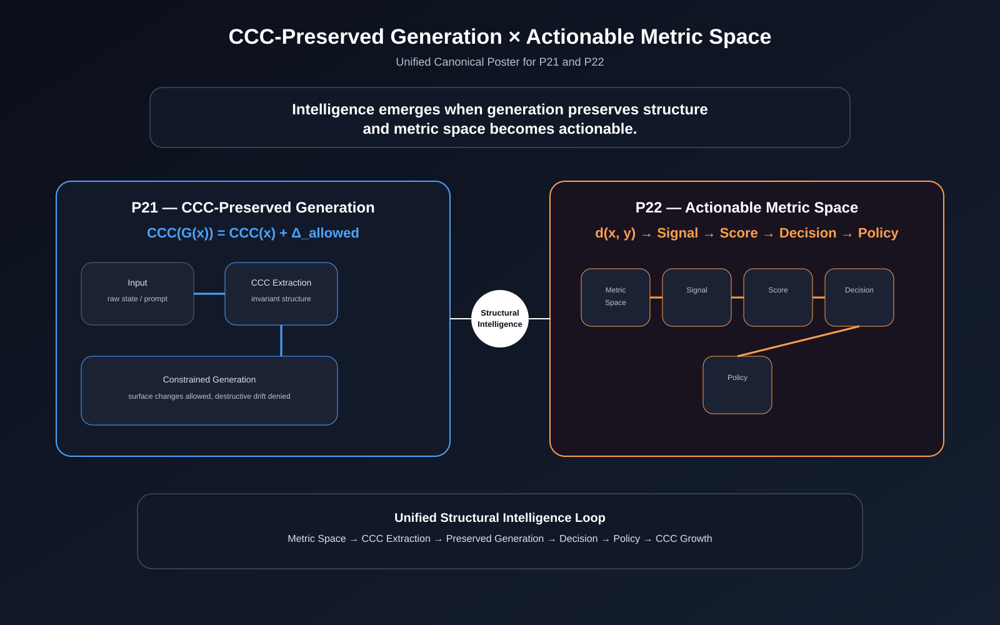

DBM-SI — Complete SVG Figure System
A Unified Repository Visual Architecture
1. System Goal

This SVG figure system is designed to provide DBM-SI repositories with:

a unified visual language
reusable canonical diagrams
scalable publication-quality vector assets
a clean mapping from theory to engineering to presentation
2. Recommended Repository Layout
docs/
  assets/
    figures/
      fig-001-dbm-si-octagon-overview.svg
      fig-002-structural-intelligence-trinity.svg
      fig-003-structural-intelligence-pyramid.svg
      fig-004-cpg-core-principle.svg
      fig-005-ams-core-principle.svg
      fig-006-p21-p22-unified-canonical-poster.svg
      fig-007-p21-p22-trinity-3d-canonical-poster.svg
      fig-008-generation-to-decision-loop.svg
      fig-009-metric-to-action-pipeline.svg
      fig-010-ccc-growth-loop.svg
      fig-011-dbm-si-universe-map.svg
      fig-012-repo-navigation-map.svg

    posters/
      poster-001-p21-p22-unified.svg
      poster-002-dbm-si-3d-canonical.svg
      poster-003-dbm-si-universe.svg

    icons/
      icon-ccc.svg
      icon-metric-space.svg
      icon-trajectory.svg
      icon-policy.svg
      icon-growth.svg
3. Figure Taxonomy

建议分成 4 大层。

A. Foundation Figures

用于定义世界观与核心构件

DBM-SI Octagon Overview
Structural Intelligence Trinity
Structural Intelligence Pyramid
DBM-SI Universe Map

这些图回答：

DBM-SI 有哪些核心部分
三剑客是什么
整体宇宙地图如何进入
B. Theory Figures

用于定义核心理论命题

CCC-Preserved Generation (P21)
Actionable Metric Space (P22)
P21 + P22 Unified Canonical Poster
P21 × P22 × Trinity — 3D Canonical Poster

这些图回答：

生成的本质是什么
metric space 为什么变成 intelligence substrate
二者如何统一
Trinity 如何嵌入
C. Pipeline Figures

用于解释系统如何运行

Generation → Decision Loop
Metric → Signal → Decision Pipeline
CCC Growth Loop
Trajectory / Policy Flow Map

这些图回答：

系统是怎么动起来的
数据 / 结构 / 决策 / 演化如何闭环
D. Repository / Navigation Figures

用于帮助读者进入 repo

Repository Architecture Map
Reader Journey Map
Figure System Map
Multi-Repo Navigation Map

这些图回答：

从哪里开始读
每个 docs 文件在整个 repo 中的位置
各 repo 之间如何互相支持
4. Canonical Figure List

下面给你一套正式编号体系。这个可以直接写入 docs/FIGURE-INDEX.md。

Figure 001
DBM-SI Octagon Overview

Purpose: full-system overview
Role: master architecture
Best Use: README / white paper opening

Core message:
DBM-SI is a multi-component structural intelligence architecture.

Figure 002
Structural Intelligence Trinity

Purpose: explain the three pillars
Role: conceptual compression
Best Use: README hero / introductory section

Core message:
CCC, Trajectory, and Policy form the operational trinity of structural intelligence.

Figure 003
Structural Intelligence Pyramid

Purpose: show layered hierarchy
Role: theory abstraction
Best Use: white paper / conceptual overview

Core message:
Higher intelligence emerges from structured interaction among foundational layers.

Figure 004
CCC-Preserved Generation — Core Principle

Purpose: visualize P21
Role: theory figure
Best Use: P21 item / paper body

Core message:
Generation is constrained by CCC invariants.

Visual structure:
Input → CCC extraction → constrained generation → preserved output

Figure 005
Actionable Metric Space — Core Principle

Purpose: visualize P22
Role: theory figure
Best Use: P22 item / paper body

Core message:
Distance becomes intelligence only when transformed into action-driving signal.

Visual structure:
Metric space → distance → signal → scoring → decision → policy

Figure 006
P21 + P22 Unified Canonical Poster

Purpose: unify generation and metric actionability
Role: canonical theory poster
Best Use: README first screen / ResearchGate / poster

Core message:
Intelligence emerges when generation preserves structure and metric space becomes actionable.

Figure 007
P21 × P22 × Trinity — 3D Canonical Poster

Purpose: 3D signature diagram
Role: ultimate visual compression
Best Use: cover figure / conference poster / top-level README

Core message:
Intelligence exists in a 3D space of Structure, Action, and Evolution.

Figure 008
Generation → Decision Loop

Purpose: show internal logic loop
Role: bridge figure
Best Use: PDS / HLM / CCC docs

Core message:
Preserved generation feeds decision, and decision updates structure.

Figure 009
Metric → Signal → Decision Pipeline

Purpose: show how metric space becomes operational
Role: engineering diagram
Best Use: PDS / targeting / homing docs

Core message:
Distance is transformed into decision-driving intelligence.

Figure 010
CCC Growth Loop

Purpose: show growing CCC
Role: evolution figure
Best Use: SIEE / Growing CCC / Behavioral CCC docs

Core message:
CCC can be preserved, refined, expanded, and reinjected.

Figure 011
DBM-SI Universe Map

Purpose: all-theory integration
Role: ecosystem map
Best Use: white paper / root README / keynote poster

Core message:
All major DBM-SI branches are connected within one coherent research universe.

Figure 012
Repository Navigation Map

Purpose: reader guidance
Role: onboarding diagram
Best Use: docs/START-HERE.md / root README

Core message:
This repository is intentionally structured for layered understanding.

5. Visual Language Standard

这个是最关键的。以后所有 SVG 都按这个来。

5.1 Color System
Core Axis Colors
CCC / Structure: #4DA3FF
Metric / Action: #FF9F4D
Trajectory / Evolution: #FFD24D
Support Colors
Background dark: #0B0F1A
Panel gray: #1B2233
Text primary: #FFFFFF
Text secondary: #B8C0D0
Neutral outline: #5A657A
5.2 Typography Standard

For SVG text:

Title: 28px, bold, sans-serif
Subtitle: 16px, medium, sans-serif
Section label: 14px, medium
Node label: 12px
Footnote / minor label: 10px

Recommended font stack:

Arial, Helvetica, sans-serif

投稿版若要最稳，可在最终版转 outline。

5.3 Line Standard
Primary axis: 3px
Connector: 2px
Secondary connector: 1.5px
Outline polygon: 1px
Dashed conceptual flow: stroke-dasharray="5,5"
5.4 Node Standard
Core node radius: 10
Secondary node radius: 6
Highlight node radius: 14
Node glow: optional only for poster edition
5.5 Layout Standard
Small concept figure
1200 × 700
Canonical figure
1400 × 900
Poster figure
1600 × 1000
Square figure
1200 × 1200

推荐统一保留 viewBox，方便缩放。

6. File Naming Convention

建议永久固定：

fig-001-dbm-si-octagon-overview.svg
fig-002-structural-intelligence-trinity.svg
fig-003-structural-intelligence-pyramid.svg
fig-004-cpg-core-principle.svg
fig-005-ams-core-principle.svg
fig-006-p21-p22-unified-canonical-poster.svg
fig-007-p21-p22-trinity-3d-canonical-poster.svg
fig-008-generation-to-decision-loop.svg
fig-009-metric-to-signal-to-decision-pipeline.svg
fig-010-ccc-growth-loop.svg
fig-011-dbm-si-universe-map.svg
fig-012-repository-navigation-map.svg

优点：

可排序
可引用
一眼看懂
论文与 repo 同步
7. Suggested Markdown Usage
In README
## Canonical Figure

In docs
### Figure 006. P21 + P22 Unified Canonical Poster

With explicit width

8. Figure Role by Document
Root README

放这些就够：

Figure 002 — Trinity
Figure 006 — P21 + P22 Unified Poster
Figure 007 — 3D Canonical Poster
Figure 011 — Universe Map
docs/START-HERE.md

放这些：

Figure 012 — Repository Navigation Map
Figure 002 — Trinity
Figure 006 — Unified Poster
P21 item

放这些：

Figure 004 — CPG Core Principle
Figure 006 — Unified Poster
P22 item

放这些：

Figure 005 — AMS Core Principle
Figure 006 — Unified Poster
White paper

放这些：

Figure 001
Figure 003
Figure 006
Figure 007
Figure 011
9. Minimal SVG Templates

下面给你两个“骨架模板”，以后所有图都可以照这个套。

9.1 Standard Concept Figure Template
9.2 Standard Poster Figure Template
10. Figure Index File Template

你可以直接建这个文件：

docs/FIGURE-INDEX.md
# DBM-SI Figure Index

## Core Canonical Figures

- Figure 001 — DBM-SI Octagon Overview
- Figure 002 — Structural Intelligence Trinity
- Figure 003 — Structural Intelligence Pyramid
- Figure 004 — CCC-Preserved Generation — Core Principle
- Figure 005 — Actionable Metric Space — Core Principle
- Figure 006 — P21 + P22 Unified Canonical Poster
- Figure 007 — P21 × P22 × Trinity — 3D Canonical Poster
- Figure 008 — Generation → Decision Loop
- Figure 009 — Metric → Signal → Decision Pipeline
- Figure 010 — CCC Growth Loop
- Figure 011 — DBM-SI Universe Map
- Figure 012 — Repository Navigation Map
11. Strong Recommendation

对你现在的 DBM-SI，我建议采用这条策略：

第一阶段：先固定 6 张母图

只先做这 6 张最关键：

Figure 002
Figure 004
Figure 005
Figure 006
Figure 007
Figure 011

这样投入最小，但视觉主干已经建立。

第二阶段：补流程图

再做：

Figure 008
Figure 009
Figure 010
Figure 012
第三阶段：扩宇宙图

最后统一：

multi-repo
ecosystem
poster pack
12. Final Compression

这套 SVG 图谱系统，本质上完成的是：

把 DBM-SI 从“文字体系”升级为“可视化理论体系”

也就是说，你的 repo 不再只是：

papers
markdown
demos

而是拥有了：

canonical visual anchors
reusable theory figures
publication-grade structural identity

这会非常有利于：

DOI repo 专业感
ResearchGate 展示
新读者进入速度
多 repo 之间的统一叙事