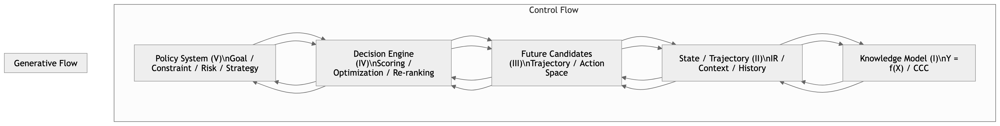

# ITEM P02
# PDS Canonical Diagram — The Fish-Control Architecture

（PDS 规范结构图——鱼控架构）

## 1. Canonical Diagram（标准结构图）

---

## 2. Diagram Interpretation（图解）

### 🔷 双向结构（核心特征）

PDS 不是单向 pipeline，而是双流结构：

### ▶ Generative Flow（生成流）
    Knowledge → State → Candidates → Decision → Policy

作用：

- 从能力出发生成可能性
- 构建未来空间

### ▶ Control Flow（控制流）
    Policy → Decision → Candidates → State → Knowledge

作用：

- 从目标出发约束选择
- 反向塑形系统行为

### 🔥 关键结论

> **智能 = 生成流 × 控制流 的耦合系统**

## 3. Fish-Control Interpretation（鱼控解释）

该结构对应：

- 鱼（行为）在水流（Policy）中运动
- 并通过内部系统（Decision）不断调整

#### 对应关系：
|层	|生物类比
|---|---|
|V Policy	|水流 / 势场
|IV Decision	|神经系统
|III Candidates	|可行动作
|II State	|感知
|I Knowledge	|生理结构

#### 🔥 本质

> **控制不是直接作用在结果上，而是作用在“可能性空间的形状”上。**

## 4. Canonical Caption（论文图注）

> **Figure P02 — PDS Canonical Diagram.**\
> The Policy Decision System is structured as a bidirectional control architecture composed of five interacting layers: Knowledge, State, Candidate Space, Decision Engine, and Policy.

> The generative flow constructs possible futures, while the control flow shapes selection through policy constraints.

> Intelligence emerges from the coupling of these two flows, forming a Fish-Control Structure where behavior is guided rather than explicitly commanded.