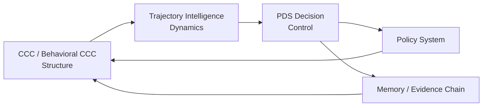

# ITEM P05
# PDS × CCC × Trajectory — The Unified Intelligence Loop

（PDS × CCC × 轨迹智能——统一智能闭环）

## 1. Three Fundamental Axes

We formally define：

|Axis	|Paradigm	|Function
|---|---|---|
|Structure	|CCC	|Expressing "What It Is"
|Dynamics	|Trajectory	|Expressing "How It Evolves"
|Control	|PDS	|Expressing "How to Choose"

## 2. Unified Loop

## 3. Functional Interpretation 
### 3.1 CCC → Trajectory

Structure determines:

- State space
- Similarity
- Reachable paths

👉 CCC is a "Space Generator."

### 3.2 Trajectory → PDS

Trajectories provide:

- Candidate paths
- Behavioral sequences
- Multiple future branches

👉 A Trajectory is a "Future Generator."

### 3.3 PDS → Policy

PDS determines:

- Which trajectory is adopted
- Which behavior is executed

👉 PDS is a "selector."

### 3.4 Policy → CCC

Policy's Reverse Impact:

- CCC Weighting
- Structural Preferences
- Modes of Expression

👉 Policy acts as a "Structure Shaper."

## 4. Closed-Loop Intelligence

    Structure → Dynamics → Decision → Policy → Structure

🔥 Key Conclusions

> **Intelligence is a self-reinforcing structural loop.**

## 5. Behavioral CCC Integration

Behavior CCC Act upon：

- Trajectory pattern extraction
- Policy trigger detection
- Regime identification

🔥 Elevated Expression

> CCC defines space\
> Trajectory defines motion\
> PDS defines selection

> Behavior CCC defines pattern over motion

## 6. DBM-SI Unified Statement）

> **DBM-SI is a closed-loop system of structure, trajectory, and policy-controlled decision.**