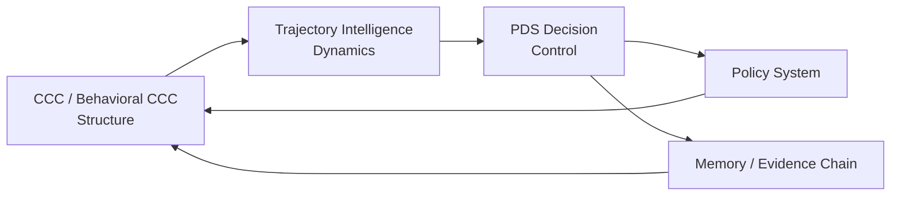

# ITEM P05
# PDS × CCC × Trajectory — The Unified Intelligence Loop

（PDS × CCC × 轨迹智能——统一智能闭环）

## 1. Three Fundamental Axes（三大基本轴）

我们正式定义：

Axis	Paradigm	Function
Structure	CCC	表达“是什么”
Dynamics	Trajectory	表达“如何演化”
Control	PDS	表达“如何选择”

## 2. Unified Loop（统一闭环）

## 3. Functional Interpretation（功能解释）
### 3.1 CCC → Trajectory

结构决定：

状态空间
相似性
可达路径

👉 CCC 是“空间生成器”

### 3.2 Trajectory → PDS

轨迹提供：

候选路径
行为序列
多未来分支

👉 Trajectory 是“未来生成器”

### 3.3 PDS → Policy

PDS 决定：

哪条轨迹被采纳
哪种行为被执行

👉 PDS 是“选择器”

### 3.4 Policy → CCC

Policy 反向影响：

CCC 权重
结构偏好
表达方式

👉 Policy 是“结构塑形器”

## 4. Closed-Loop Intelligence（闭环智能）
Structure → Dynamics → Decision → Policy → Structure
🔥 核心结论

Intelligence is a self-reinforcing structural loop.

## 5. Behavioral CCC Integration（Behavior CCC 融合）

Behavior CCC 作用于：

Trajectory pattern extraction
Policy trigger detection
Regime identification

🔥 升级表达

CCC defines space
Trajectory defines motion
PDS defines selection

Behavior CCC defines pattern over motion

## 6. DBM-SI Unified Statement（统一声明）

DBM-SI is a closed-loop system of structure, trajectory, and policy-controlled decision.