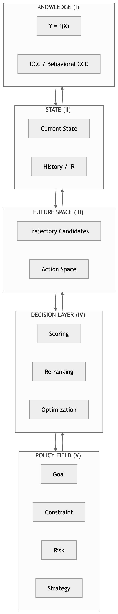

# ITEM P08
# PDS Canonical Poster — One-Page Paradigm

（PDS 终极一页范式图）

## 1. Poster Layout

# 

## 2. Poster Tagline

> **PDS: Intelligence as Policy-Controlled Traversal over Future Space**

## 3. Three Core Messages

#### 🔷 1. Not Prediction — Control

    AI (old): predict Y
    PDS: select Y under policy

#### 🔷 2. Five Pillars Structure

    Knowledge × State × Future × Decision × Policy

#### 🔷 3. Dual Flow System

    Generative Flow × Control Flow

## 4. Trinity Integration

    CCC (Structure)
            ↓
    Trajectory (Dynamics)
            ↓
    PDS (Control)

## 5. Poster Caption

> **Figure P08 — PDS Canonical Poster.**\
> A unified one-page representation of the Policy Decision System. \
> Intelligence is modeled as a bidirectional interaction between generative and control flows across five layers. \
> The Policy layer shapes the decision landscape, enabling controlled traversal of future trajectories rather than passive prediction.