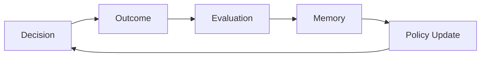

# ITEM P09
# Policy Learning & Adaptation in PDS

（PDS 中的策略学习与自适应）

## 1. Why Policy Must Learn

Static Policy:

- Unable to adapt to environmental changes
- Unable to handle regime shifts

👉 Must be upgraded to:

> Adaptive Policy System

## 2. Policy Learning Loop（策略学习闭环）

## 3. Learning Signals

Policy Update Source：

### 3.1 Outcome-based
- reward
- success/failure

### 3.2 Trajectory-based
- path efficiency
- stability
- smoothness

### 3.3 Risk-based
- variance
- tail events
- failure probability

### 3.4 Structural (CCC-based)
- pattern alignment
- behavioral similarity
- CCC coherence

## 4. Policy Parameterization

    Policy = f(
        goals,
        constraints,
        risk tolerance,
        strategy weights
    )

## 5. APTGOE Integration

#### Policy Evolution：

|Stage	|Policy Role
|---|---|
|Autonomous	|self-adjust
|Parameterization	|tune weights
|Generative	|create new policy variants
|Optimization	|select best policy
|Evolution	|retain / discard

#### 🔥 Core Concept

> Policy is not fixed — it is an evolving structure.

## 6. Multi-Level Adaptation

#### Level 1: Decision-level
- Adjust the scoring function

#### Level 2: Policy-level
- Adjust objectives / risk parameters

#### Level 3: Structure-level
- Modify the CCC / representation

## 7. Final Insight

> Learning is not just improving decisions — \
> it is evolving the policy that governs decisions.