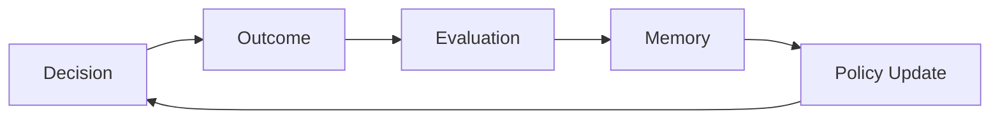

# ITEM P09
# Policy Learning & Adaptation in PDS

（PDS 中的策略学习与自适应）

## 1. Why Policy Must Learn（为什么 Policy 必须学习）

静态 Policy：

无法适应环境变化
无法处理 regime shift

👉 必须升级为：

Adaptive Policy System

## 2. Policy Learning Loop（策略学习闭环）

## 3. Learning Signals（学习信号）

Policy 更新来源：

### 3.1 Outcome-based
reward
success/failure

### 3.2 Trajectory-based
path efficiency
stability
smoothness

### 3.3 Risk-based
variance
tail events
failure probability

### 3.4 Structural (CCC-based)
pattern alignment
behavioral similarity
CCC coherence

## 4. Policy Parameterization（策略参数化）
Policy = f(
    goals,
    constraints,
    risk tolerance,
    strategy weights
)

## 5. APTGOE Integration（演化接入）
Policy 演化：
Stage	Policy Role
Autonomous	self-adjust
Parameterization	tune weights
Generative	create new policy variants
Optimization	select best policy
Evolution	retain / discard

🔥 核心表达

Policy is not fixed — it is an evolving structure.

## 6. Multi-Level Adaptation（多层自适应）

### Level 1：Decision-level
调整评分函数

### Level 2：Policy-level
调整目标 / 风险

### Level 3：Structure-level
改变 CCC / 表达

## 7. Final Insight（终极洞察）

Learning is not just improving decisions —
it is evolving the policy that governs decisions.