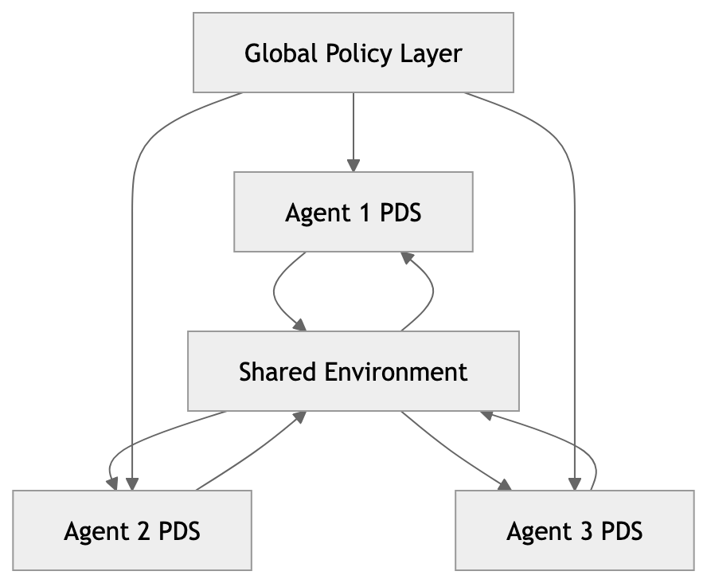

# ITEM P10
# Multi-Agent PDS — Collective Decision Systems

（多智能体 PDS——群体决策系统）

## 1. Motivation（动机）

现实系统不是单一 agent：

- 市场
- 自动驾驶车群
- AI coding agents

👉 需要：

> **Multi-Agent PDS (MAPDS)**

## 2. Architecture（架构）

---

## 3. Key Components（关键组成）
### 3.1 Individual PDS

每个 agent：

    I × II × III × IV × V

### 3.2 Shared Environment
- 状态共享
- trajectory 交互

### 3.3 Global Policy（关键）
- 协调
- 冲突解决
- 资源分配

## 4. Interaction Modes（交互模式）

#### 🔷 Cooperative（协作）
- 共享目标
- 集体优化

#### 🔷 Competitive（竞争）
- 对抗策略
- 博弈

#### 🔷 Hybrid（混合）
- 局部竞争 + 全局协作

## 5. Emergent Behavior（涌现行为）

多 PDS 系统会出现：

- market dynamics
- traffic patterns
- swarm intelligence

🔥 本质

> Collective intelligence emerges from interacting policy-controlled agents.

## 6. Conflict Resolution（冲突解决）

通过：

- policy hierarchy
- negotiation
- voting / scoring

## 7. DBM-SI Context（在 DBM-SI 中）

可扩展为：

- 多 trajectory intelligence 交互
- CCC 对齐与冲突
- policy 传播

## 8. Final Insight（终极洞察）

> Single-agent intelligence selects actions. \
> Multi-agent intelligence shapes worlds.