# ITEM P12
# Formalization of PDS — Mathematical Expression of Policy Decision Systems

（PDS 的数学化表达）

## 1. Motivation

If PDS remains solely at the conceptual level, it becomes difficult to:

- Perform theoretical derivations
- Conduct benchmarking
- Establish runtime contracts
- Make cross-system comparisons

Therefore, a **minimal mathematical skeleton** is required.

## 2. Basic Objects

我们定义：

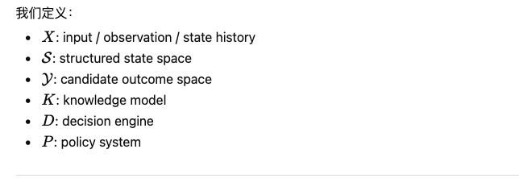

## 3. Five-Pillar Formalization

### Pillar I — Knowledge

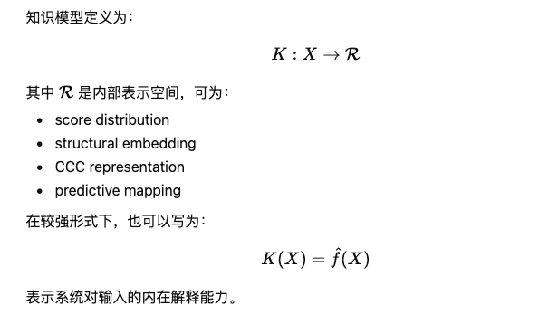

### Pillar II — State Construction

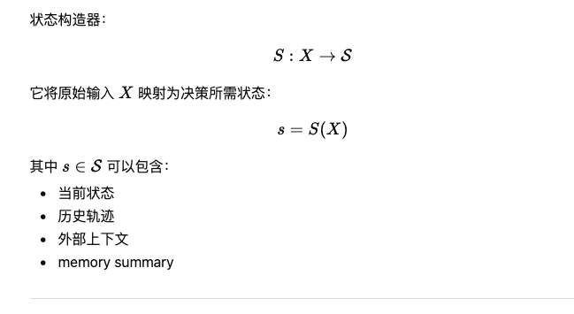

### Pillar III — Candidate Generator

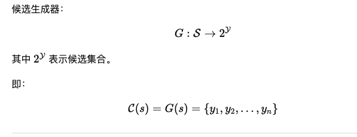

### Pillar IV — Decision Engine

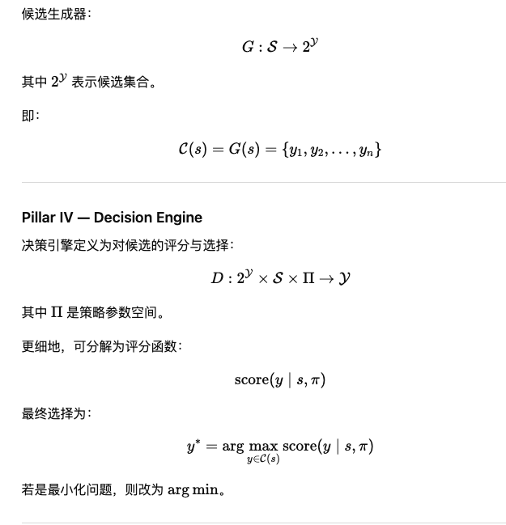

### Pillar V — Policy System

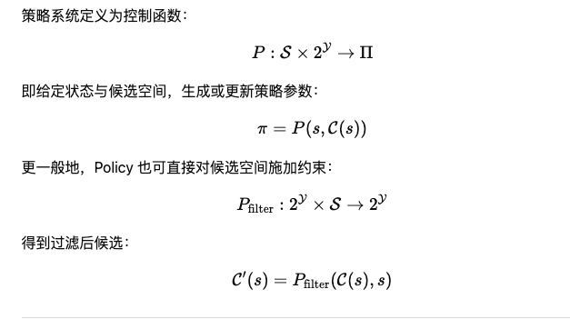

## 4. Overall Decision Equation

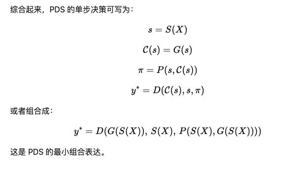

## 5. Policy-Deformed Decision Space

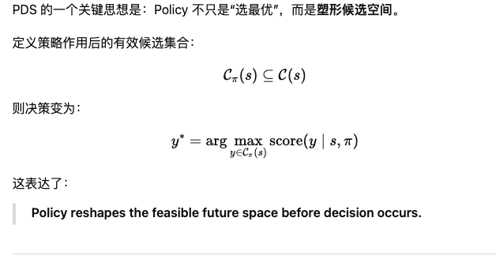

## 6. Dynamic PDS

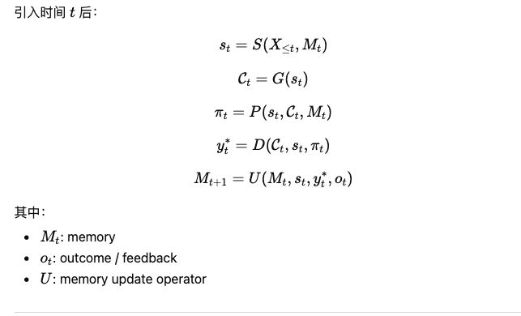

## 7. Policy Learning

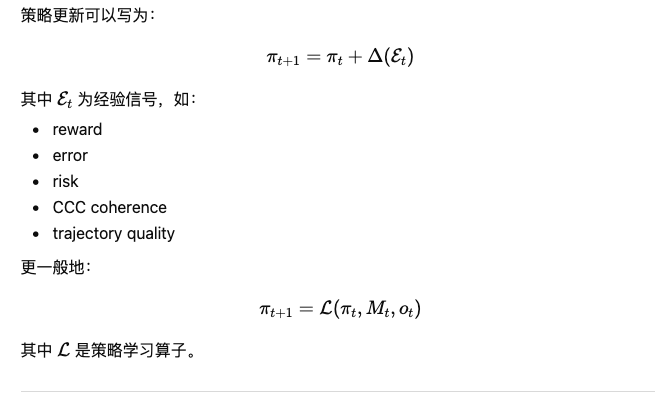

## 8. Multi-Agent Extension

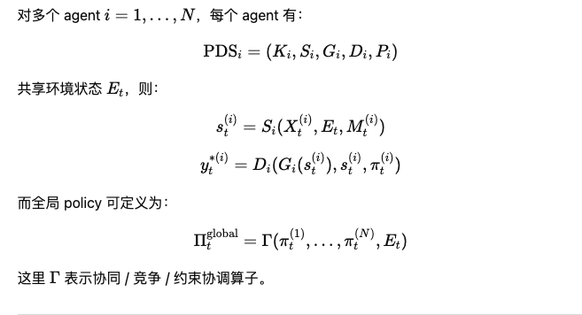

## 9. Final Mathematical Statement

> **A Policy Decision System is a structured decision process in which state construction, candidate generation, policy deformation, and decision selection are composed into a closed-loop control system over future space.**