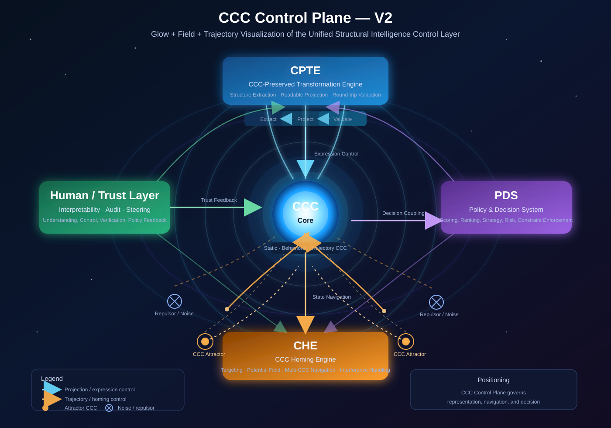

# Y30 - CCC Control Plane
### A Unified Control Layer for Structural Intelligence Systems

---

---
## Abstract

This document introduces the **CCC Control Plane**, a unified control layer for structural intelligence systems within the DBM-SI (Digital Brain Model — Structural Intelligence) framework.

The CCC Control Plane integrates:

- **Representation Control** (via CCC-Preserved Transformation Engine, CPTE)
- **State Navigation** (via CCC Homing Engine, CHE)
- **Decision Control** (via Policy & Decision System, PDS)
- **Human Trust & Interpretability**

All components are coordinated through a shared **CCC (Common Concept Core) space**, which acts as a universal structural coordinate system.

This work addresses a fundamental gap in modern AI systems:

> the lack of a unified, controllable, and trustworthy control layer across generation, reasoning, and decision processes.

## 1. Background and Motivation
### 1.1 The Problem of AI Coding and Structural Opacity

Recent discussions in the AI community, including those by Jeremy Howard, highlight a growing concern:

- Developers rapidly lose **interactive control** over AI-generated systems
- Code becomes **opaque and difficult to verify**
- Trust in AI-generated artifacts is weakened

This exposes a core issue:

> AI systems lack a mechanism to preserve and expose their **structural essence** during generation and execution.

### 1.2 From Generation to Control

Traditional AI pipelines focus on:

- generation (LLMs)
- prediction
- optimization

However, they lack:

- structural invariants
- controllable representations
- unified navigation in state space

This motivates a shift:

> from **generation-centric AI to control-centric structural intelligence**

### 1.3 DBM-SI Evolution Context

Within DBM-SI, several pillars were already established:

- CCC (Common Concept Core)
- Trajectory Intelligence
- Policy & Decision System (PDS)
- Differential Tree / Metric Space routing

The CCC Control Plane emerges as the **next logical layer**, integrating these into a unified control architecture.

## 2. Core Concept: CCC as a Universal Coordinate System

CCC (Common Concept Core) represents:

- structural invariants
- behavioral patterns
- trajectory signatures

We define:

> **CCC = the coordinate system of structural intelligence**

All transformations, decisions, and trajectories can be mapped into CCC space.

## 3. CCC Control Plane — Definition
### 3.1 Formal Definition

[ \
CCC_{ControlPlane} =
{ CCC,\ CPTE,\ CHE,\ PDS,\ Human_Trust } \
]

### 3.2 Functional Role

The CCC Control Plane governs:

|Dimension	|Controlled By
|---|---|
|Representation (code, model)	|CPTE
|State / trajectory	|CHE
|Decision / policy	|PDS
|Trust / interpretability	|Human Layer

## 4. Architecture Overview

### 4.1 Structural Layout
- **Center:** CCC Core (shared structural space)
- **Top:** CPTE (expression control)
- **Bottom:** CHE (state navigation)
- **Right:** PDS (decision system)
- **Left:** Human / Trust Layer

## 5. CPTE — CCC-Preserved Transformation Engine
### 5.1 Purpose

CPTE ensures that transformations preserve structural essence:

[\
Program \rightarrow CCC \rightarrow Program'\
]

### 5.2 Key Functions
- CCC extraction
- structure-preserving projection
- human-readable simplification
- round-trip consistency validation

### 5.3 Significance

CPTE addresses:

- interpretability
- controllability
- trust in AI-generated code

## 6. CHE — CCC Homing Engine
### 6.1 Purpose

CHE enables navigation in state space using CCC:

[\
State \rightarrow CCC\ space \rightarrow Target\
]

### 6.2 CCC Potential Field

[\
F(x) = \sum_i w_i \cdot D(x, CCC_i)\
]

- ( w_i > 0 ): attractor
- ( w_i < 0 ): repulsor

### 6.3 Capabilities
- multi-target navigation
- interference handling
- trajectory optimization
- adversarial robustness

### 6.4 Interpretation

CHE generalizes:

- navigation systems
- recommendation targeting
- risk-aware trajectory control

## 7. PDS — Policy & Decision System
### 7.1 Role

PDS operates as the decision layer:

[\
Decision = f(CCC, Policy, Risk)\
]

### 7.2 Functions
- scoring and ranking
- policy profiles (safe / aggressive / test)
- constraint enforcement
- strategy synthesis

## 8. Human / Trust Layer
### 8.1 Role

The human layer ensures:

- interpretability
- auditability
- controllability
- trust verification

### 8.2 Feedback Loop

Human feedback influences:

- CPTE projection choices
- PDS policy parameters
- CHE targeting preferences

## 9. Unified Insight

The CCC Control Plane reveals a fundamental principle:

> **All intelligent processes can be controlled through a shared structural coordinate system (CCC).**

## 10. Contributions
1. A unified control architecture for AI systems
2. Structure-preserving generation (CPTE)
3. CCC-based navigation under interference (CHE)
4. Integration of decision, trajectory, and structure
5. A trust-aware human–AI control loop

## 11. Positioning

CCC Control Plane can be understood as:

> **The Operating System Kernel of Structural Intelligence**

## 12. Glossary of Terms

|Term	|Meaning
|---|---|
|CCC	|Common Concept Core — structural invariant representation
|CPTE	|CCC-Preserved Transformation Engine
|CHE	|CCC Homing Engine
|PDS	|Policy & Decision System
|DBM-SI	|Digital Brain Model — Structural Intelligence
|Trajectory Intelligence	|intelligence over state evolution
|Metric Distance	|similarity/distance in CCC space

## 13. Outlook

The CCC Control Plane opens a new direction:

- controllable AI systems
- trustworthy AI coding
- unified decision-navigation frameworks
- structural intelligence operating systems

Future work includes:

- real-time CCC control loops
- integration with HLM (Hyperlanguage Models)
- large-scale system deployment

## References
- DBM-SI Architecture Repository
- Trajectory Intelligence
- Policy & Decision System
- Discussions inspired by Jeremy Howard on AI coding and control