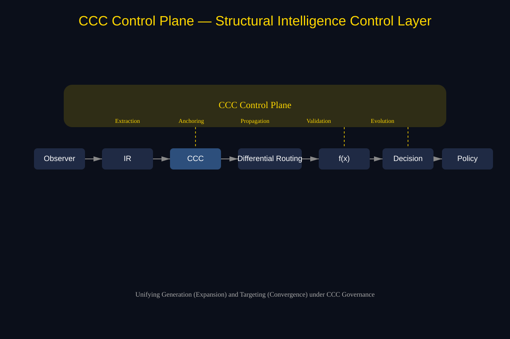

# Control Plane of Structural Intelligence Systems
##— Toward Controllable, Structure-Aware, and Evolvable AI

#### Authors: Sizhe Tan, GPT-Obot
#### Date: 2026-03-30

## Abstract

Modern AI systems have achieved unprecedented capabilities in generation, perception, and decision-making. However, they lack a unified mechanism for **structural control**, leading to critical challenges in interpretability, safety, and governance.

In this paper, we introduce the **Control Plane of Structural Intelligence Systems**, a novel architectural abstraction that governs transformation, targeting, decision, and evolution through **CCC (Common Concept Core) invariants**.

We show that:

- Generative AI can be reframed as **CCC-preserved transformation**
- Targeting and navigation can be reformulated as **CCC-based convergence** in metric space
- Decision systems can be grounded via **structure-constrained policies**

These capabilities are unified under the **CCC Control Plane**, which acts as a horizontal control layer across the intelligence stack.

We argue that this control plane is essential for transitioning from:

> **Structure discovery → Structure navigation → Structure control**

and represents a foundational step toward **controllable, auditable, and evolvable AI systems**.

## 1. Introduction
###  1.1 The Missing Layer in Modern AI

Contemporary AI systems exhibit three dominant capabilities:

- **Generation** (LLMs, diffusion models)
- **Search & Targeting** (retrieval, planning, navigation)
- **Decision-making** (policies, reinforcement learning)

Despite their success, they share a fundamental limitation:

> **They lack a unified control layer that enforces structural consistency.**

This results in:

- Uncontrolled generation
- Unstable targeting
- Policy decisions detached from structure
- Limited auditability and governance

### 1.2 From Capability to Control

We observe that:

- Generation modifies structure
- Targeting converges to structure
- Decision selects among structures

However, no system ensures that these operations remain:

> **consistent, interpretable, and controllable**

### 1.3 Contribution

We introduce:

> **CCC Control Plane — the control layer of structural intelligence systems**

Our contributions:

1. A **unified abstraction** for structural control
2. A reinterpretation of generative AI as **CCC-preserved transformation**
3. A new paradigm of **CCC-based targeting/homing**
4. A system-level integration with **Policy & Decision Systems (PDS)**
4. A framework for **human-AI governance via structural invariants**

---

---

## 2. Background and Motivation
### 2.1 Structural Intelligence (DBM-SI)

DBM-SI defines intelligence as operating on:

- **CCC (structure)**
- **Trajectory (dynamics)**
- **Policy (decision)**

### 2.2 Limitations of Current Paradigms
##### Generative AI
- High capability, low controllability
- Weak structural guarantees

##### Planning & Targeting
- Coordinate-based, not structure-based
- Fragile in high-dimensional spaces

#####Decision Systems
- Often detached from structural representation
- Lack invariant enforcement

### 2.3 Core Hypothesis

> **Intelligence becomes controllable only when structure is explicitly enforced across all operations.**

## 3. CCC Control Plane
### 3.1 Definition

CCC Control Plane = A system that enforces structural invariants across transformation, navigation, decision, and evolution

### 3.2 Architectural Overview

##### Figure 3 — CCC Control Plane Unified Architecture

The Control Plane operates as a horizontal layer across:

    Observer → IR → CCC → Routing → f(x) → Decision → Policy
                        ↑
                 CCC Control Plane

### 3.3 Core Functions
#### 1. CCC Extraction
- Extract structure from IR, trajectories, and artifacts
#### 2. CCC Anchoring
- Define targets, constraints, and reference structures
#### 3. CCC Propagation
- Inject structural constraints into all operations
#### 4. CCC Validation
- Enforce invariants and detect structural violations
#### 5. CCC Evolution
- Grow and refine CCC via feedback and trajectory learning

## 4. CCC-preserved Generation
### 4.1 Reframing Generative AI

We interpret generation as:

> **Traversal within a CCC-constrained structural manifold**

### 4.2 Properties
- Structure-preserving
- Constraint-injectable
- Auditable

### 4.3 Implications
- Enables controlled code generation
- Bridges AI output and human governance
- Reduces black-box opacity

## 5. CCC-based Targeting / Homing
### 5.1 From Coordinates to Structure

Traditional targeting:

- Coordinate-based
- Static

DBM-SI targeting:

> **CCC-based, metric-space convergence**

### 5.2 Mechanisms
- CCC anchoring
- Differential routing
- Two-phase search
- Dynamic targets

### 5.3 Interpretation

> Targeting becomes **structure alignment**, not position reaching.

## 6. Integration with Policy & Decision Systems (PDS)
### 6.1 Pipeline

    X → f(X) → Y → Decision → Policy

### 6.2 Control Plane Role
- Constrains f(X)
- Validates Y
- Guides decision scoring
- Enforces policy

### 6.3 Result

> Decision becomes **structure-aware and policy-aligned**

## 7. Human–AI Governance
### 7.1 Problem

AI systems today lack:

- Transparency
- Auditability
- Legal interpretability

### 7.2 CCC Control Plane Solution

Provides:

- Structural traceability
- Constraint injection
- Policy enforcement
- Safety guarantees

### 7.3 Key Insight

> **Trust emerges when structure is visible and enforceable.**

## 8. Structural Intelligence Evolution

The Control Plane supports:

- CCC growth (SIEE)
- Trajectory evolution (TIEE)
- Continuous refinement

## 9. Positioning
### 9.1 Paradigm Shift

|Stage	|Capability
|---|---|
|Statistical AI	|Pattern fitting
|Structural AI	|Structure discovery
|Structural Control AI (this work)	|Structure control

### 9.2 Unified System

> **CCC (Structure) + Trajectory (Dynamics) + PDS (Decision) + Evolution**\
> unified by\
> **CCC Control Plane**

## 10. Discussion
### 10.1 Why This Matters

Without control:

- AI systems scale unpredictably
- Safety becomes reactive
- Governance becomes external

With Control Plane:

- Control is **intrinsic**
- Structure is **first-class**
- Governance is **embedded**

### 10.2 Limitations
- Requires robust CCC extraction
- Metric space design complexity
- Computational overhead

### 10.3 Future Work
- Formal CCC invariants (math formulation)
- Control Plane compilers / runtimes
- Large-scale system validation

## 11. Conclusion

We introduced the **CCC Control Plane**, a new architectural layer for structural intelligence systems.

It enables:

- Controlled generation
- Structured targeting
- Policy-aligned decision
- Human-governable AI

## One-Line Statement

> **The CCC Control Plane transforms AI from powerful systems into controllable intelligence.**